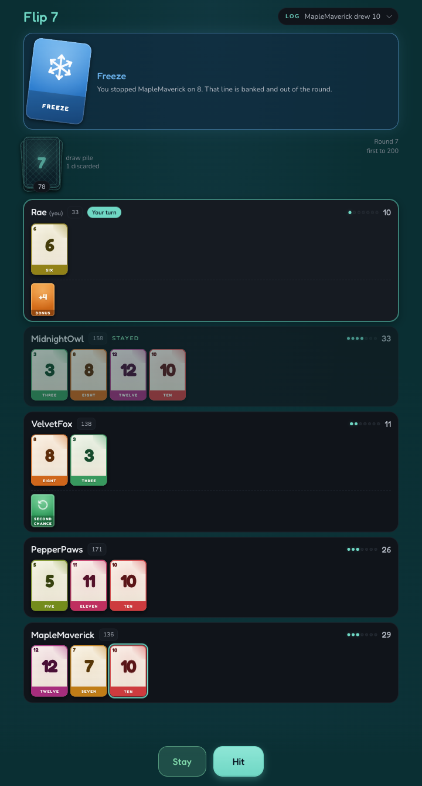
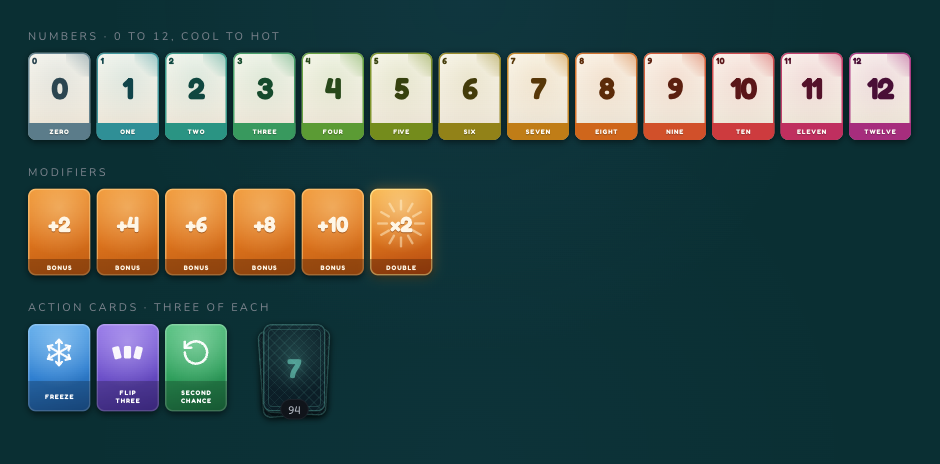

# flip7

A web version of **Flip 7**, the push-your-luck card game. Hit for one more card, or bank what you have before a duplicate takes the lot.

Built on [@laurelwood/card-class](https://github.com/745laurelwood/card-class), the shared skin behind the other Laurelwood games.



## Rules

### The deck



94 cards.

**Number cards (79).** 0 through 12, and each number appears as many times as its value: twelve 12s, eleven 11s, on down to a single 1, plus one lone 0. That weighting is the whole game — the big cards are worth the most and are also the likeliest to come back and bust you. The colour runs with the count, so a slate 0 is the safest card in the deck and a hot magenta 12 is the one most likely to end your round.

**Modifiers (6).** One each of +2, +4, +6, +8, +10 and ×2. They score, but none of them count towards the seven.

**Action cards (9).** Three each of Freeze, Flip Three and Second Chance.

### Your turn

**Hit** to take one card, or **Stay** to bank what is in front of you and sit out the rest of the round.

Draw a number you already have and you **bust**: out of the round, scoring nothing at all, however good the line looked. The pair that did it stays in colour on a line that has otherwise gone grey, so you can see what happened without reading the log.

### Flip 7

Get **seven different numbers** in front of you and the round ends immediately for everyone, with **15 bonus points** to you. Modifiers and action cards do not count towards the seven.

### Action cards

Draw a Freeze or a Flip Three and you choose who it lands on, yourself included. A Second Chance is yours; only a spare, drawn while you are already holding one, has to be given away. If you are the last player still in the round, it lands on you.

- **Freeze** — that player stays right now, banking whatever they have.
- **Flip Three** — that player draws three cards, one at a time. Busting stops the run, and anything they turn up along the way waits until it is over.
- **Second Chance** — you keep it, and it saves you from the first duplicate you draw. Nobody holds two: a spare goes to someone without one, or is discarded.

### Scoring

Add up your number cards. A ×2 doubles **that total only**. Then add the +N modifiers, and 15 more if you flipped 7.

So 3 + 4 + 12 with a ×2 and a +10 is 19, doubled to 38, then 48.

Busting scores nothing.

### Winning

At the end of the round in which anyone reaches **200**, the highest score wins.

## Reading the table

Everything in Flip 7 is face up, so a seat is a row rather than a hand and the whole table is readable at a glance. The screenshot above has all of it in one frame.

**Seven pips** beside a name are how close that line is to ending the round. They turn gold at six, which is the point at which everyone else needs to know.

**Numbers sit on the top row**, everything else underneath at a smaller size behind a dashed rule. The top row of a seat is the count; nothing below it moves anyone closer to seven.

**A seat that has stopped says why.** Staying was a choice and shows as `STAYED`; being frozen was not, and shows a snowflake. Anyone out of the round goes quiet so the seats still deciding are the ones that stand out — except a seat that flipped seven, which keeps a gold ring, having just won the round.

**Two moments get held up** for a couple of seconds, because they leave nothing behind to look at. A Second Chance discards both the duplicate and itself, so the table shows the pair with the number that nearly got you. A Freeze is discarded on the spot and all it leaves is a status flipping over on somebody else's seat, so the table names who stopped whom and on what.

The in-app **Rulebook** covers the same ground with the cards themselves, drawn by the same component the table uses.

## Run locally

```bash
npm install
npm run dev
```

It serves on port 3007, so it can run alongside the other games.

## Playing with other people

Create a room and share the four-letter code. Two to eight seats; anything nobody claims becomes a bot when the host deals, so a table of three humans and five bots is fine.

The host runs the game — it owns the draw pile, the bots and the timers — and everyone else sends what their player did and renders what comes back. Turning up after the deal makes you a spectator until the next match.

Flip 7 has no hidden hands: every card in play is face up in front of its owner. The one secret is the draw pile, so that is the only thing stripped before the state goes out. The table still shows how many cards are left, because the pile is replaced with blanks of the same length rather than emptied.

Refreshing offers to resume you back into the room you were in.

## Bots

They reason from public information only — the deck list is printed on the box and every card in play is face up — so a bot counts the copies of each number still unseen and hits while the expected gain clears the expected loss. It never looks at the draw pile.

## The cards

Drawn from scratch in `components/Flip7Card.tsx` rather than through the shared skin's `CardComponent`, which puts a suit and a rank on a card and these have neither.

The printed deck is the reference: a number is a pale card with the numeral filling it and the same number spelled out underneath, modifiers sit on orange, and each action card is a solid colour with a symbol on it.

The one place we go further than the cardboard is colour. On the table every number card looks alike, because the deck itself tells you the odds — there is one 1 and there are twelve 12s, so a 12 is the card most likely to come back and bust you. On a screen that is invisible, so the numbers run cool to hot. The colour only shows you what the deck list already says.

Sizes come off one token. `--f7-w` sets the width, the aspect ratio fixes the height, and the card's font size is derived from its width — so every part of a face is written in `em` and one number rescales the whole thing. See `theme.ts` for the palette and the words.

## Moments and sound

The reducer records what just happened rather than leaving it to be read back out of the log: the kind, the seat, the number behind it, and a count that goes up each time. Both the banners and the cues follow from that.

They have to. `endRound` runs inside the same dispatch as the bust or the seventh number that ended the round, appending a score line per seat, so anything matching on the newest log entry misses exactly the moments most worth hearing.

There are eight cues: a card landing, a stay, a bust, a Freeze, a Second Chance, a seven, a round ending and a match being won. A card landing is driven off the state rather than the dispatch sites, so everyone at the table hears every card instead of the host hearing only its own, and it stands down when a bust or a save is already sounding.
